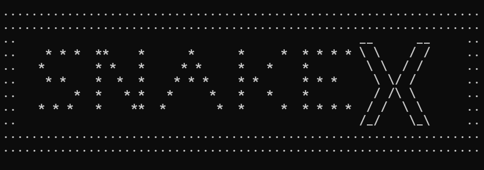

# SNAKEX - (A C++ Snake Game)

**snakeX** is a simple and fun snake game developed in C++ using the IDE Dev-C++. The game is based on the classic Snake game, where the player controls a snake to eat food and grow in size while avoiding collisions with walls and itself.



## Features
- **Classic Snake Game**: The classic mechanics where the snake eats food to grow longer.
- **Console-Based Gameplay**: Playable in a terminal.
- **Dynamic Difficulty**: The game speeds up as the snake grows.
- **Game Over & Restart**: The game ends when the snake collides with a wall or itself, with an option to restart.
- **Simple Controls**: Easy-to-learn gameplay using keyboard.

## Installation

### Prerequisites
- C++ compiler (Dev-C++ IDE)

### Steps to Install
1. **Clone the repository**:
    ```bash
    git clone https://github.com/ThasuniInduma/project-c-.git
    ```

2. **Navigate to the project directory**:
    ```bash
    cd project-c-
    ```

3. **Open the project in Dev-C++**

4. **Compile and run** the `Snake_X.cpp` file.

---

## Controls

- **w,a,s,d Keys**: Control the direction of the snake (Up, Down, Left, Right).
- **p Key**: Pause the game.

---

## Gameplay

- **Objective**: Guide the snake to eat food while avoiding collisions with the walls or its own body.
- As the snake eats, it grows longer.
- The game ends when the snake hits a wall or itself.

---

## How to Play

1. **Start the Game**: When you run the game, the snake will start moving in a default direction.
2. **Eat Food**: Use the keys to guide the snake toward food (represented by # character on the screen).
3. **Avoid Collisions**: Don’t let the snake collide with the walls or its tail!
4. **Game Over**: When the snake collides, the game ends. You can restart the game or exit.

---

## Acknowledgments

Thank you for the collaborators to collaboration, passion, and effort in making this project a success!
